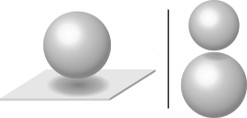

# caspwn
A tool to calculate the Casimir interaction between two spheres of arbitrary radii (R1 and R2) or a sphere and a plane immersed in a dielectric medium.
The Casimir energy is calculated within the scattering theory using plane waves as a basis for the electromagnetic modes.
A Nystrom discretization is employed to make the continuous basis amendable for linear algebra routines.

<p align="center">
  
</p>

## Installation

caspwn is written in Python and uses Cython for performance improvements. Note that Cython requires a C compiler to be present on the system.
The package can be easily installed with the package installer [pip](https://pypi.org/project/pip/). First navigate to package folder
```
cd path/to/caspwn
```
If you do not wish to install the package into your base python library, you may want to create a [virtual environment](https://docs.python.org/3/tutorial/venv.html) before installing the package. A virtual environment can be created with
```
python -m venv env
```
To activate the environment on Unix/MacOS, run:
```
source env/bin/activate
```
or on Windows, run:
```
env/Scripts/activate
```

Finally, install the package with the command
```
pip install .
```

## Getting started

### Example 1 (sphere-sphere geometry)

We calculate the Casimir force between two spheres of radius R1=10um and R2=20um at a separation of 1um at room temperature (T=300K).
The spheres are assumed to be perfect reflecting (material=PEC) and immersed in vacuum.

First we import the `sphere_sphere_system` class and the materials of the spheres and the dielectric medium:
```
from caspwn import sphere_sphere_system
from caspwn.materials import PEC, vacuum
```
We can then create a `sphere_sphere_system` instance corresponding to the geometry we are interested in:
```
s = sphere_sphere_system(T=300., L=1.e-6, R1=10.e-6, R2=20.e-6, mat_sphere1=PEC, mat_sphere2=PEC, mat_medium=vacuum)
```
Calling the `calculate` method with the desired observable as an argument then yields the result for the Casimir force
in units of Newton:
```
print(s.calculate('force'))
>>> -6.803006937069336e-15
```
The resulting Casimir force is attractive (negative sign) and about 6.8fN in magnitude. 

### Example 2 (plane-sphere geometry)

We calculate the Casimir force gradient (which is commonly measured in experiments using an AFM) between a sphere of
radius 50um and a plane at a separation of 100nm at room temperature (T=300K).
The sphere and plane are assumed to be gold (modeled by a simple Drude model with a plasma frequency of 9eV and a
dissipation constant of 35meV). The medium is vacuum.

The calculation is similar to the one presented in Example 1. We instead define the `plane_sphere_system` and calculate
the force gradient:
```
from caspwn import plane_sphere_system
from caspwn.materials import gold_drude as gold, vacuum
s = plane_sphere_system(T=300., L=100.e-9, R=50.e-6, mat_plane=gold, mat_sphere=gold, mat_medium=vacuum)
s.calculate('forcegradient')
>>> 7.948084793980571e-05
```
The resulting Casimir force gradient is about 79.4uN/m.

## Documentation (wip)

The documentation contains more information about the classes and functions defined in this package.
It can be built using [sphinx](https://www.sphinx-doc.org/en/master/).
First navigate to the documentation folder
```
cd docs/
```
and execute the command
```
make html
```
to build the documentation. The html files can be found in the folder `docs/build/html` and they can be viewed with any standard web browser.


## Publications using caspwn

* [Plane-wave approach to the exact van der Waals interaction between colloid particles](http://aip.scitation.org/doi/10.1063/5.0011368)\
  Benjamin Spreng, Paulo A. Maia Neto, Gert-Ludwig Ingold, The Journal of Chemical Physics **153**, 024115 (2020). DOI:10.1063/5.0011368 [arXiv:2004.11889](https://arxiv.org/abs/2004.11889)

* [Measurement of the Casimir Force between 0.2 and 8 μm: Experimental Procedures and Comparison with Theory](https://www.mdpi.com/2218-1997/7/4/93)\
  Guiseppe Bimonte, Benjamin Spreng, Paulo A. Maia Neto, Gert-Ludwig Ingold, Galina L. Klimchitskaya, Vladimir M. Mostepanenko, Ricardo S. Decca, Universe **7**, 93 (2021). DOI:10.3390/universe7040093 [arXiv:2104.03857](https://arxiv.org/abs/2104.03857)

* [Casimir Interaction between a Plane and a Sphere: Correction to the Proximity-Force Approximation at Intermediate Temperatures](https://www.mdpi.com/2218-1997/7/5/129)\
  Vinicius Henning, Benjamin Spreng, Paulo A. Maia Neto, Gert-Ludwig Ingold, Universe **7**, 129 (2021). DOI:10.3390/universe7050129 [arXiv:2103.13927](https://arxiv.org/abs/2103.13927)

* [The Casimir Interaction between Spheres Immersed in Electrolytes](https://www.mdpi.com/2218-1997/7/5/156)\
  Renan O. Nunes, Benjamin Spreng, Reinaldo de Melo e Souza, Gert-Ludwig Ingold, Paulo A. Maia Neto, Felipe S. S. Rosa, Universe **7**, 156 (2021). DOI:10.3390/universe7050156

* [Probing the screening of the Casimir interaction with optical tweezers](https://link.aps.org/doi/10.1103/PhysRevResearch.3.033037)\
  Luis B. Pires, Diney S. Ether, Benjamin Spreng, *et al.*, Physical Review Research **3**, 033037 (2021). DOI:10.1103/PhysRevResearch.3.033037 [arXiv:2104.00157](https://arxiv.org/abs/2104.00157)

* [Casimir effect between spherical objects: Proximity-force approximation and beyond using plane waves](https://www.worldscientific.com/doi/10.1142/S0217751X22410093)\
  Tanja Schoger, Benjamin Spreng, Gert-Ludwig Ingold, Paulo A. Maia Neto, International Journal of Modern Physics A **37**, 2241009 (2022). DOI:10.1142/S0217751X22410093 [arXiv:2205.10819](https://arxiv.org/abs/2205.10819)

* [Universal Casimir Interaction between Two Dielectric Spheres in Salted Water](https://link.aps.org/doi/10.1103/PhysRevLett.128.230602)\
  Tanja Schoger, Benjamin Spreng, Gert-Ludwig Ingold, Paulo A. Maia Neto, Serge Reynaud, Physical Review Letters **128**, 230602 (2022). DOI:10.1103/PhysRevLett.128.230602 [arXiv:2112.08800](https://arxiv.org/abs/2112.08800)

* [Universal Casimir interactions in the sphere–sphere geometry](https://www.worldscientific.com/doi/10.1142/S0217751X22410056)\
  Tanja Schoger, Benjamin Spreng, Gert-Ludwig Ingold, Astrid Lambrecht, Paulo A. Maia Neto, Serge Reynaud, International Journal of Modern Physics A **37**, 2241005 (2022). DOI:10.1103/PhysRevLett.128.230602 [arXiv:2205.10812](https://arxiv.org/abs/2205.10812)

